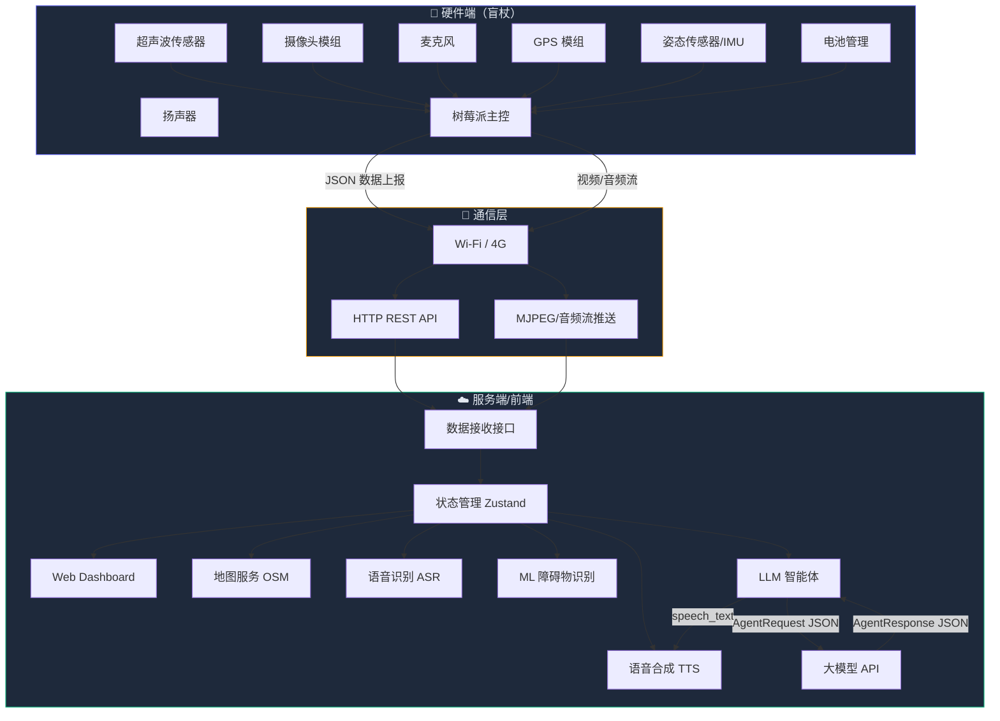
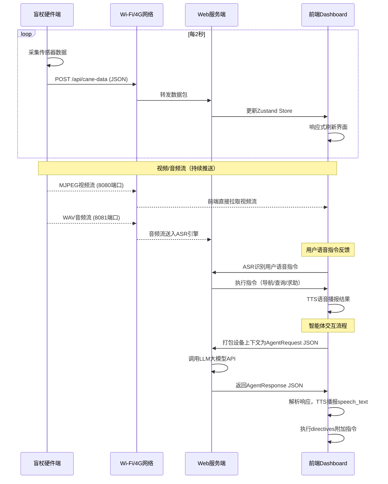

# 3.1 产品设计与功能

## 3.1.1 产品概述

"智能盲杖"是一款面向视障人群的智能辅助出行设备，通过多传感器融合、AI 视觉识别、语音交互和实时导航等技术，为视障用户提供安全、自主的出行体验。产品由**嵌入式硬件端**（树莓派 + 传感器组）和 **Web 监控/管理端**（前端 Dashboard）组成。

---

## 3.1.2 系统总体架构

本系统采用"端—网—云"三层架构。盲杖硬件端以树莓派 4B 为主控，连接超声波、IMU、GPS、摄像头、麦克风等传感器，负责实时采集环境数据并打包为标准 JSON 格式；通信层通过 Wi-Fi 或 4G 网络，以 HTTP REST 接口上报结构化数据，同时推送 MJPEG 视频流和 WAV 音频流；Web 前端作为应用层，基于 React + TypeScript 构建单页应用，集成 Zustand 状态管理、Leaflet 地图、Recharts 可视化等模块；智能层提供 LLM 大模型 Agent 对话、ML 障碍物识别（预留）和 ASR 语音识别（预留）三项 AI 能力。各层之间通过明确定义的接口解耦，便于独立开发和测试。



---

## 3.1.3 软件环境与技术栈

本项目涉及嵌入式端、Web 前端、AI 服务三个软件子系统，各子系统的运行环境和技术选型如下。

### 嵌入式端（树莓派）

树莓派 4B 运行 Raspberry Pi OS（基于 Debian 12 Bookworm），使用 Python 3.11 作为主开发语言。传感器驱动通过 `RPi.GPIO`（超声波 Trig/Echo）、`smbus2`（I2C 读取 MPU6050）、`pyserial`（UART 解析 GPS NMEA）等库实现。视频推流使用 `mjpg-streamer`，音频推流使用 `ffmpeg`，两者均已在树莓派生态中成熟稳定。数据上报使用 `requests` 库以 HTTP POST 发送 JSON。

| 层次 | 技术 | 版本 / 说明 |
|------|------|-------------|
| 操作系统 | Raspberry Pi OS (64-bit) | Debian 12 Bookworm |
| 运行时 | Python | 3.11 |
| GPIO 驱动 | RPi.GPIO | 超声波 Trig/Echo 脉宽测距 |
| I2C 驱动 | smbus2 | 读取 MPU6050 加速度/陀螺仪 |
| 串口通信 | pyserial | GPS NMEA 0183 协议解析 |
| 视频推流 | mjpg-streamer | USB 摄像头 → MJPEG HTTP 流 |
| 音频推流 | ffmpeg | 麦克风 → WAV HTTP 流 |
| HTTP 上报 | requests | JSON POST，2 秒周期 |
| ML 推理（预留） | TensorFlow Lite / ONNX Runtime | MobileNet-SSD INT8 量化模型 |

### Web 前端

前端为纯静态 SPA，无需后端服务器即可运行（通过 Vite 开发服务器或 Nginx 静态托管）。核心技术栈为 React 19 + TypeScript 5.x，构建工具为 Vite 6，包管理器为 pnpm。状态管理选用 Zustand（~1KB），地图渲染选用 Leaflet + OpenStreetMap 免费瓦片，可视化图表选用 Recharts，动效选用 Framer Motion，图标选用 Lucide React。UI 采用 Glassmorphism 深色毛玻璃风格，全部使用原生 CSS 模块化编写，未引入第三方 UI 框架。

| 层次 | 技术 | 版本 / 说明 |
|------|------|-------------|
| 构建工具 | Vite | 6.x，HMR 热更新 |
| 包管理 | pnpm | 10.x，高效磁盘空间 |
| 框架 | React | 19.x |
| 类型系统 | TypeScript | 5.x，严格模式 |
| 状态管理 | Zustand | 5.x，selector 订阅 |
| 路由 | React Router | v7，嵌套路由 |
| 地图 | Leaflet + React-Leaflet | OpenStreetMap 瓦片 |
| 图表 | Recharts | AreaChart 趋势图 |
| 动画 | Framer Motion | 页面过渡 + 组件动效 |
| 图标 | Lucide React | 轻量 SVG 图标 |
| TTS | Web Speech Synthesis API | 浏览器原生中文语音 |
| 录音 | MediaRecorder API | 浏览器原生录音 |

### AI 服务层

AI 能力分为三个模块，当前已实现 LLM 智能体（含 Mock 模式），ML 视觉检测和 ASR 语音识别作为预留接口设计，后续接入时无需改动前端架构。

| 模块 | 当前状态 | 技术方案 | 接入方式 |
|------|----------|----------|----------|
| LLM 智能体 | **已实现** | OpenAI Compatible API（GPT-4o / DeepSeek / Qwen）+ 本地 Mock 规则引擎 | 前端直接调用 `/chat/completions`，AgentRequest/Response JSON 协议 |
| ML 障碍物检测 | 预留接口 | MobileNet-SSD + TFLite，COCO 2017 预训练 + ORBIT/SEVN 微调 | 树莓派端推理，检测结果通过 JSON `obstacles` 字段上报 |
| ASR 语音识别 | 预留接口 | Whisper / FunASR（中文优化），或浏览器 Web Speech Recognition API | 音频流送入识别引擎，结果写入 Store `asrResults` |

### 预留后端接口

当前版本前端直连硬件和 LLM API，尚未部署独立后端。后续如需多用户管理、数据持久化等功能，预留以下后端技术方案：

| 组件 | 候选方案 | 说明 |
|------|----------|------|
| 后端框架 | FastAPI (Python) / Express (Node.js) | RESTful API + WebSocket 实时推送 |
| 数据库 | SQLite（单机）/ PostgreSQL（多用户） | 存储历史轨迹、告警记录、对话日志 |
| 消息队列 | Redis Pub/Sub（预留） | 多设备数据分发，解耦采集与消费 |
| 部署 | Docker + Nginx | 前后端容器化，静态资源 CDN 加速 |

---

## 3.1.4 软硬件接口定义

硬件端与 Web 前端之间的通信以 JSON 为唯一数据格式，这样做的好处是前后端开发者可以使用任何语言解析和生成数据、方便调试抓包、也便于后期扩展字段。树莓派每隔 2 秒通过 HTTP POST 发送一次数据包，包含系统信息（电量、状态）、传感器读数（距离、跌倒、GPS）和流媒体地址（视频、音频）三大部分。以下是典型的 JSON 数据结构：

```json
{
  "system": {
    "battery": 85,
    "status": "online"
  },
  "sensors": {
    "distance_cm": 120,
    "fall_alert": false,
    "gps": {
      "lat": 31.2304,
      "lng": 121.4737
    }
  },
  "streams": {
    "video_url": "http://192.168.1.xxx:8080/?action=stream",
    "audio_url": "http://192.168.1.xxx:8081/audio.wav"
  }
}
```

### 接口字段说明

| 字段 | 类型 | 说明 | 来源硬件 |
|------|------|------|----------|
| `system.battery` | `int` | 电量百分比 0-100 | 电池管理模块 |
| `system.status` | `string` | 设备状态：`online` / `offline` / `error` | 树莓派系统 |
| `sensors.distance_cm` | `int` | 超声波前方测距，单位 cm | HC-SR04 超声波传感器 |
| `sensors.fall_alert` | `bool` | 跌倒检测状态 | IMU 姿态传感器 |
| `sensors.gps.lat` | `float` | GPS 纬度 | GPS 模组 |
| `sensors.gps.lng` | `float` | GPS 经度 | GPS 模组 |
| `streams.video_url` | `string` | 摄像头 MJPEG 视频流地址 | 树莓派摄像头 + mjpg-streamer |
| `streams.audio_url` | `string` | 麦克风音频流地址 | USB 麦克风 + ffmpeg |

### 软硬件交互流程



### 智能体通信协议

前端将设备上下文打包为 **AgentRequest** JSON 发送给 LLM大模型，接收 **AgentResponse** 结构化响应：

**AgentRequest（发送给LLM）：**
```json
{
  "request_id": "req_1707840000_1",
  "timestamp": "2026-02-13T12:00:00.000Z",
  "user_intent": "导航到最近的地铁站",
  "device_context": {
    "battery": 85,
    "status": "online",
    "gps": { "lat": 31.2304, "lng": 121.4737 },
    "distance_cm": 120,
    "fall_alert": false
  },
  "obstacles": [
    { "label": "行人", "distance_cm": 180, "confidence": 0.92 }
  ],
  "navigation": {
    "destination": "人民广场地铁站",
    "remaining_distance_m": 450,
    "current_step": "直行200米"
  },
  "recent_asr": ["导航到最近的地铁站"]
}
```

**AgentResponse（LLM返回）：**
```json
{
  "request_id": "req_1707840000_1",
  "timestamp": "2026-02-13T12:00:01.200Z",
  "speech_text": "好的，正在为您规划到最近地铁站的路线，预计步行8分钟",
  "action": "navigate",
  "confidence": 0.95,
  "directives": [
    { "type": "set_destination", "params": { "name": "最近地铁站" } }
  ],
  "reasoning": "用户请求导航到地铁站，当前GPS在人民广场附近"
}
```

---

## 3.1.5 核心功能清单（按重要性排序）

产品功能按优先级划分为三个层次。**P0（核心安全功能）** 是用户出行安全的底线保障，包括障碍物距离检测、跌倒报警和 GPS 定位，这三项功能在任何场景下都必须可用，即使网络断开也应通过本地蜂鸣器和振动马达进行告警。**P1（核心体验功能）** 是产品差异化竞争力的来源，涵盖地图导航规划、LLM 智能语音播报和语音指令控制，让用户能够通过自然语言与盲杖交互，获取导航指引和环境描述。**P2（智能增强功能）** 面向后续迭代，包括 AI 视觉识别、视频流分析、监控仪表盘和智能体多轮对话，为产品持续进化预留接口。

### 功能详细说明

#### 🔴 P0 — 核心安全功能（必须优先保障）

| # | 功能 | 描述 | 输入 | 输出 | 软件模块 |
|---|------|------|------|------|----------|
| 1 | **超声波障碍物距离检测** | 实时读取前方障碍物距离，以颜色/数值高亮显示；距离 <50cm 触发危险警报，<150cm 注意提醒 | `sensors.distance_cm` | 仪表盘显示 + 蜂鸣/语音警报 | Dashboard + ObstaclePanel |
| 2 | **跌倒检测与紧急警报** | 通过 IMU 姿态传感器判断异常跌倒，前端全屏横幅警报 | `sensors.fall_alert` | 全屏alert横幅 + 语音播报 | Dashboard 跌倒警报模块 |
| 3 | **GPS 实时定位** | 在地图上实时显示用户当前位置，支持坐标追踪 | `sensors.gps.lat/lng` | Leaflet地图标记 + 坐标显示 | MapNavigation |

#### 🟡 P1 — 核心体验功能

| # | 功能 | 描述 | 输入 | 输出 | 软件模块 |
|---|------|------|------|------|----------|
| 4 | **地图导航与路线规划** | 搜索目的地，基于 OpenStreetMap 规划步行路线，分步导航指引 | GPS坐标 + 用户输入目的地 | 路线折线 + 分步指令列表 | MapNavigation |
| 5 | **LLM 智能播报** | 将设备上下文（GPS/距离/障碍/电量/ASR）打包为 AgentRequest JSON 发送给大模型，接收 AgentResponse 结构化响应后 TTS 播报；支持多模型切换（GPT-4o/DeepSeek/通义千问）、音量/语速控制 | AgentRequest JSON | AgentResponse JSON → TTS语音 | SmartBroadcast + llmAgent 服务 |
| 6 | **语音识别指令控制** | 用户通过语音发出指令（导航/查询/求助），ASR 引擎识别并执行 | 麦克风音频流 | 指令文本 + 执行结果 | VoiceControl |

#### 🟢 P2 — 智能增强功能

| # | 功能 | 描述 | 输入 | 输出 | 软件模块 |
|---|------|------|------|------|----------|
| 7 | **AI 视觉障碍物识别** | 基于 ML 模型分析视频流，识别行人/车辆/台阶等障碍物类型及距离（预留接口） | 视频流 | 检测框+分类标签+置信度 | ObstaclePanel ML模块 |
| 8 | **视频流实时预览** | 在 Dashboard 显示摄像头画面，叠加检测结果 bbox | `streams.video_url` | 视频画面+检测叠加层 | ObstaclePanel |
| 9 | **设备状态监控仪表盘** | 汇总展示电量、在线状态、距离趋势图、最近播报等 | 全部 JSON 字段 | 综合监控面板 | Dashboard |
| 10 | **智能体多轮对话** | 支持与 LLM 智能助手多轮交互，快捷指令面板，可展开查看完整 JSON 请求/响应，支持 API Key 配置 | 用户文本/语音 + 设备上下文 | 对话界面 + JSON 调试面板 | SmartBroadcast Agent Chat |

---

## 3.1.6 前端页面结构

前端共包含 5 个核心页面，统一在 `Layout` 布局组件内渲染，Layout 提供可折叠的侧边栏导航和顶栏状态指示（电量、在线状态）。所有页面在路由切换时通过 Framer Motion `AnimatePresence` 实现平滑过渡动画。

- **Dashboard（仪表盘）**：首页总览，包含距离/电量径向仪表盘、最近 60 条距离趋势图（Recharts AreaChart）、跌倒警报全屏横幅、障碍物速览列表以及最近播报速览。作为护理人员或调试者了解设备整体状态的入口。
- **ObstaclePanel（障碍检测）**：核心安全页面。上方为超声波距离大号仪表盘和色条可视化，下方为摄像头视频流预览区（叠加 ML 检测框占位），底部展示检测结果表格，并预留模型上传/刷新按钮。
- **VoiceControl（语音控制）**：录音交互页面。中心为带脉冲动画的大面积录音按钮（`MediaRecorder` API），上方实时显示音频波形可视化，下方滚动展示 ASR 识别结果列表。当浏览器不支持录音权限时自动回退至模拟模式。
- **MapNavigation（地图导航）**：基于 Leaflet + OpenStreetMap 的全屏地图，GPS 实时跟随用户位置（蓝色脉冲标记），支持目的地搜索和路线折线绘制，右侧面板展示分步导航指令和坐标信息。
- **SmartBroadcast（智能播报）**：LLM 智能体交互页面。左侧为多轮 AI 对话面板（支持快捷指令、JSON 调试展开），右侧为 LLM 配置面板（模型选择、API Key 输入）、TTS 控制（音量/语速滑块、自动播报开关）和播报历史记录列表（支持按类型筛选）。

公共组件包括 `GlassCard`（毛玻璃卡片容器，支持标题、图标、强调色配置）和 `RadialGauge`（SVG 圆环仪表盘，支持动态颜色阈值和 Framer Motion 动画）。

---

## 3.1.7 数据流架构

前端的数据流动遵循单向数据流原则。数据入口有两个：真实场景下由盲杖硬件通过 HTTP POST 每 2 秒上报一次 JSON 数据包；开发调试时由内置的 Mock 模拟器以相同频率随机生成数据。两者统一写入 Zustand Store 这一全局状态中心。

Store 按业务域划分为多个 slice：`caneData`（设备基础数据）、`obstacles`（障碍物检测结果）、`asrResults`（语音识别记录）、`navigation`（导航状态）、`broadcasts`（播报记录）和 `agentMessages`（智能体对话历史）。各页面通过 Zustand 的选择器（selector）订阅自己关心的 slice，仅在相关数据变化时触发重渲染，避免不必要的性能开销。

智能体交互形成一条特殊的数据环路：用户在智能播报页面发出指令后，前端从 Store 中收集设备实时上下文（包括 GPS、距离、障碍物、电量等），与用户意图一同打包为 `AgentRequest` JSON 发送给 LLM API，收到 `AgentResponse` 后解析其中的 `speech_text` 交给 TTS 播报，同时解析 `directives` 执行附加动作（如设置导航目的地），并将对话记录回写到 Store 供界面展示。
