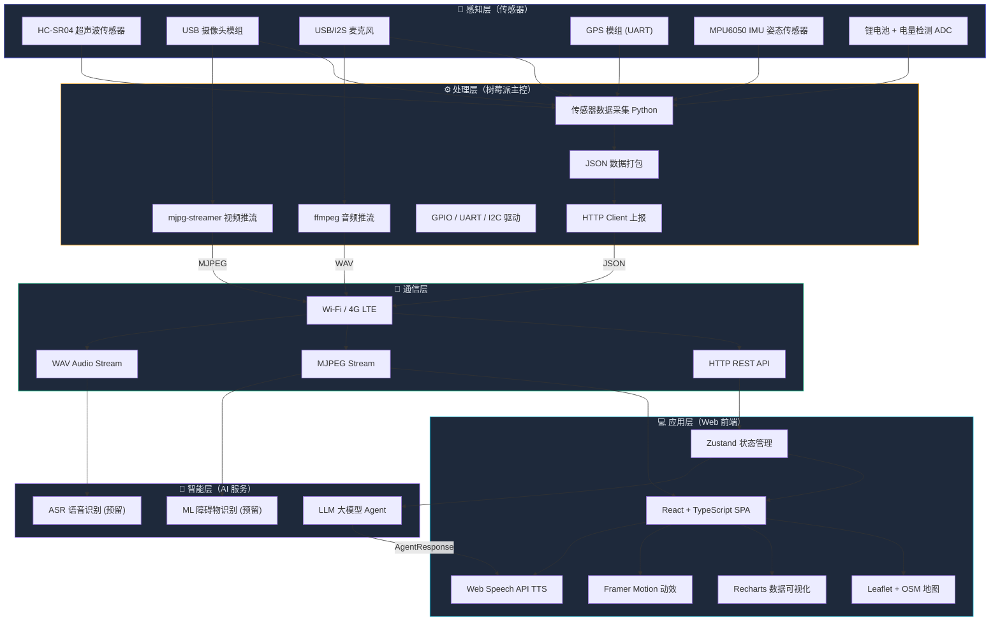
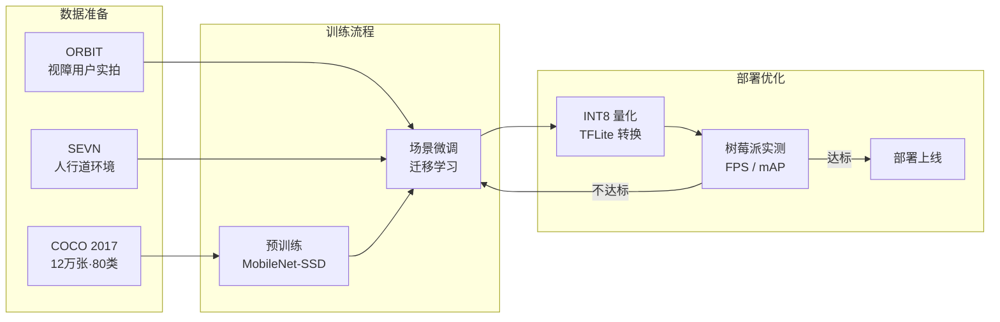

# 3.2 技术实现路径

## 3.2.1 技术架构图

系统技术架构自下而上分为五层。最底层是**感知层**，由 6 种传感器负责环境感知；往上是**处理层**，树莓派运行 Python 脚本进行数据采集、打包和推流；中间是**通信层**，通过 Wi-Fi/4G 承载 JSON 数据和音视频流；再往上是**应用层**，React SPA 负责数据可视化和用户交互；顶层是**智能层**，提供 LLM Agent、ML 识别和 ASR 识别三项 AI 能力。

前端软件内部采用"数据入口 → Store → 服务/页面"的单向流架构：HTTP 接口或 Mock 模拟器将数据写入 Zustand Store，Store 按业务域划分为 7 个 slice（设备数据、障碍物、语音识别、导航、播报、智能体消息、LLM 配置），5 个页面和 3 个服务（llmAgent、TTS、MediaRecorder）各自订阅所需 slice，实现松耦合。

---

## 3.2.2 关键技术详解

### 一、多传感器数据融合

多传感器融合是盲杖安全性的核心。树莓派端通过 Python 脚本统一采集超声波（GPIO）、IMU（I2C）、GPS（UART）、电量（ADC）四路异构传感器数据。由于各传感器采样率差异较大——超声波 10Hz、IMU 50Hz、GPS 仅 1Hz——系统采用统一时间戳机制进行对齐：以 2 秒为周期，将各传感器在该窗口内的数据取平均或最新值后打包为一帧 JSON 上报。超声波测距采用 5 次采样取中位数的中值滤波策略消除多径反射噪声；IMU 跌倒检测则基于加速度阈值判断（>2.5g 持续 100ms 视为跌倒）；GPS 的城市峡谷漂移问题通过卡尔曼滤波平滑处理。

| 传感器 | 接口 | 采样频率 | 数据处理 |
|--------|------|----------|----------|
| HC-SR04 超声波 | GPIO (Trig/Echo) | 10Hz | 中值滤波去噪，取 5 次采样中位数 |
| MPU6050 IMU | I2C | 50Hz | 加速度阈值判断跌倒（>2.5g 持续 100ms） |
| GPS 模组 | UART 9600bps | 1Hz | NMEA 0183 协议解析，提取 GGA 语句 |
| 电量 ADC | SPI/I2C | 0.5Hz | 电压-电量查表映射 |

### 二、LLM 智能体架构

LLM 智能体是本项目区别于传统盲杖产品的核心创新。其设计思路是：**将设备的实时物理状态转化为大模型可理解的结构化上下文，让 AI「看到」用户当前的处境，从而给出有针对性的导航建议和环境描述**。

具体实现上，前端在用户发起交互时，从 Zustand Store 中收集完整设备快照——当前 GPS 坐标、前方障碍距离、检测到的障碍物列表、电量、导航状态、最近的 ASR 识别结果——将其与用户意图一同打包为 `AgentRequest` JSON。该 JSON 通过 OpenAI Compatible API（`POST /chat/completions`）发送给大模型，System Prompt 严格约束模型输出为 JSON 格式，包含 `speech_text`（TTS 播报文本）、`action`（动作标识）和 `directives`（附加指令数组，如设置导航目的地）。前端收到 `AgentResponse` 后自动触发 TTS 播报并执行指令。

为降低对单一模型的依赖，系统支持多模型热切换，用户可在配置面板中选择不同的后端：

| 模型 | API 接入方式 | 适用场景 |
|------|-------------|----------|
| GPT-4o / GPT-4o-mini | OpenAI Compatible API | 最强理解能力，复杂指令 |
| DeepSeek-Chat | OpenAI Compatible API | 高性价比，中文优化 |
| 通义千问 Qwen | DashScope API | 国内低延迟 |
| 模拟模式 (Mock) | 本地规则匹配 | 开发调试，无需 API Key |

### 三、前端可视化与交互

前端采用 React + TypeScript 技术栈，以 Vite 作为构建工具，整体设计语言为深色毛玻璃风格（Glassmorphism）——通过 `backdrop-filter: blur(20px)` 配合半透明背景和彩色描边实现，既保证视觉层次感，也让信息在深色背景下清晰可读。

状态管理选用 Zustand 而非 Redux，原因在于 Zustand 体积仅 ~1KB、API 极简，可以直接通过 selector 订阅 Store 的某个 slice 而无需编写 reducer，特别适合本项目这种"多数据源、多页面消费"的场景。路由基于 React Router v7 的嵌套路由实现，配合 Framer Motion 的 `AnimatePresence`，在页面切换时实现无缝淡入/滑入过渡效果。

可视化方面，核心仪表盘使用自研的 `RadialGauge` SVG 圆环组件，支持根据当前值动态切换颜色阈值（绿→黄→红），动画由 Framer Motion 驱动；趋势图使用 Recharts 的 `AreaChart`，保留最近 60 条历史记录并以渐变填充增强视觉效果。TTS 语音播报直接使用浏览器原生 Web Speech Synthesis API，无需额外服务器，支持中文语音和音量/语速调节。

| 技术点 | 实现方案 | 说明 |
|--------|----------|------|
| 状态管理 | Zustand | 轻量级，直接订阅 slice，避免不必要重渲染 |
| 路由 | React Router v7 | 嵌套路由 + AnimatePresence 页面过渡 |
| 仪表盘 | SVG 圆环 + Framer Motion | RadialGauge 组件，动态颜色阈值 |
| 趋势图 | Recharts AreaChart | 60 条历史记录，渐变填充 |
| 地图 | Leaflet + OpenStreetMap | 免费瓦片，GPS 实时跟随，路线折线 |
| 动画 | Framer Motion | 卡片入场、警报脉冲、波形可视化 |
| TTS | Web Speech Synthesis API | 浏览器原生中文语音，音量/语速可调 |
| 录音 | MediaRecorder API | 浏览器原生录音，权限不足自动回退模拟模式 |
| UI 风格 | Glassmorphism | `backdrop-filter: blur(20px)` + 半透明 + 彩色边框 |

### 四、地图导航服务

地图导航是视障用户自主出行的关键能力。前端选用 Leaflet + React-Leaflet 轻量组合方案，底图使用 OpenStreetMap 免费瓦片服务，兼顾全球覆盖和零成本运营。用户位置通过 GPS 模组实时上报，前端收到新坐标后调用 `useMap().setView()` 自动平移地图中心，并在用户位置绘制带 CSS 脉冲动画的蓝色圆点标记，直观指示实时方位。

路线规划方面，当前版本预留了 OSRM（Open Source Routing Machine）和 GraphHopper 两个开源引擎的接口，后续接入后可实现真实的步行路线计算。规划完成后，路线以 Polyline 折线渲染在地图上，并生成分步导航指令列表（如"直行 200 米后左转"），可选择由 TTS 逐步播报，也可通过 LLM 智能体对指令进行自然语言润色后再播报，提升听觉体验。

| 组件 | 技术 | 说明 |
|------|------|------|
| 地图底图 | OpenStreetMap 瓦片 | 免费开源，全球覆盖 |
| 地图渲染 | Leaflet + React-Leaflet | 轻量地图库，移动端友好 |
| 路线规划 | 预留 OSRM / GraphHopper 接口 | 开源路线规划引擎 |
| 实时跟随 | `useMap().setView()` | GPS 更新时自动平移地图中心 |
| 用户标记 | CSS 脉冲圆点 | `user-marker-pulse` 动画指示当前位置 |

---

## 3.2.3 技术壁垒分析

本项目的技术壁垒集中在五个方向：边缘 AI 推理（在算力有限的树莓派上运行实时检测模型）、多传感器融合（异构数据的同步与容错）、实时通信（低延迟上报与弱网降级）、LLM 集成（Prompt 约束与成本控制）、以及无障碍交互设计（面向视障用户的全语音闭环）。以下逐一分析各方向的具体挑战和解决思路。

### 壁垒一：边缘 AI 推理

树莓派 4B 的算力上限决定了不能直接运行 YOLOv8 等重型神经网络。我们的对策是"轻量模型 + 动态调度"：选用 MobileNet-SSD 作为基础检测网络，通过 TFLite 框架进行 INT8 量化后模型体积从 >200MB 压缩到 <20MB，推理延迟可控制在单帧 <200ms（约 5 FPS）。同时引入动态帧率策略——当 IMU 检测到用户静止时降为 1 FPS 以节约功耗，用户移动时恢复 5 FPS 以保证检测实时性。

| 挑战 | 详细描述 | 解决方案 |
|------|----------|----------|
| 算力受限 | 树莓派 4B 仅 1.5GHz 四核 ARM，无 GPU | 采用 TFLite / ONNX Runtime 轻量推理框架 |
| 模型体积 | 原始 YOLO 模型 >200MB | 应用 INT8 量化 + 剪枝，压缩至 <20MB |
| 推理延迟 | 实时检测要求 <500ms/帧 | MobileNet-SSD 替代方案，达到 5-10 FPS |
| 功耗约束 | 电池供电场景续航要求 >8h | 动态推理频率：静止时 1FPS，移动时 5FPS |

### ML 障碍物检测模型训练规划

模型训练采用"通用预训练 + 场景微调"的两阶段策略，混合三个互补数据集覆盖不同场景需求：

- **COCO 2017**（Common Objects in Context）：约 12 万张标注图像、80 个物体类别，提供行人、车辆、自行车等通用目标的检测基线，用于模型预训练阶段建立基础特征提取能力。
- **ORBIT**（Object Recognition for Blind Image Training）：专为视障用户设计，包含由盲人和低视力用户手持设备拍摄的真实场景图像，物体姿态和光照条件更贴合盲杖实际使用场景，用于微调阶段提升模型在视障场景下的鲁棒性。
- **SEVN**（Sidewalk Environment Video Dataset）：街道人行道环境视频数据集，包含路面障碍、台阶、路缘石等步行场景特有目标，弥补 COCO 对户外步行障碍物覆盖不足的问题。

训练完成后通过 TFLite Converter 进行 INT8 量化，在树莓派 4B 上验证推理速度（目标 >5 FPS）和检测精度（目标 mAP >0.6）。若指标不达标则调整微调超参或增加数据增强后重新迭代。

### 壁垒二：多传感器数据同步

四种传感器采样率从 0.5Hz 到 50Hz 不等，直接拼接会产生时间偏移和数据冲突。系统采用"统一时间戳 + 插值补齐"策略：每 2 秒为一个数据帧窗口，高频传感器取窗口内均值，低频传感器取最近一次有效值并线性插值。当超声波与视觉检测的距离结果不一致时，采用加权融合（超声波 0.7 + 视觉 0.3）取最终值，因为超声波在近距离更可靠。此外，系统内置传感器健康检测——如某路传感器连续 5 帧返回异常值则自动标记故障并降级。

| 挑战 | 详细描述 | 解决方案 |
|------|----------|----------|
| 采样率不一致 | 超声波 10Hz、IMU 50Hz、GPS 1Hz | 统一时间戳对齐，插值补齐低频数据 |
| 数据冲突 | 超声波与视觉检测距离不一致 | 加权融合：超声波权重 0.7 + 视觉权重 0.3 |
| 传感器故障 | 单点传感器失灵导致系统瘫痪 | 故障检测 + 自动降级策略，保证核心功能可用 |
| 数据噪声 | 超声波多径反射、GPS 城市峡谷效应 | 中值滤波 + 卡尔曼滤波组合去噪 |

### 壁垒三：LLM 智能体集成

将大语言模型引入嵌入式辅助设备场景面临三重矛盾：延迟（用户等不起 3 秒以上）、成本（频繁调用 API 月费可观）、可靠性（云端服务可能不可用）。我们的应对是"本地规则优先 + 云端 LLM 兜底"的混合架构：常见场景（"前方有障碍物""电量不足"等）由本地规则引擎直接生成话术，延迟 <50ms；仅当用户意图复杂（如"帮我找一条避开楼梯的路线"）时才调用云端 LLM。输出可控性方面，通过 System Prompt 严格约束模型只输出 JSON 格式，并在前端做 JSON Schema 校验，不合格的响应会回退到本地规则。

| 挑战 | 详细描述 | 解决方案 |
|------|----------|----------|
| 响应延迟 | 云端大模型 API 延迟 1-3 秒 | 本地规则引擎预处理常见场景，仅复杂意图调用 LLM |
| 输出不可控 | LLM 可能返回非结构化文本 | System Prompt 约束 + JSON Schema 校验 |
| Token 成本 | 频繁调用月费用可观 | 上下文窗口裁剪，仅发送最近 5 条记录 |
| 离线场景 | 无网络时 LLM 不可用 | 内置 Mock 模式，基于规则匹配生成本地应答 |

### 壁垒四：无障碍交互设计

这是一个常被工程团队忽视但对产品成败至关重要的壁垒。视障用户无法看到屏幕，因此所有信息传递必须通过听觉和触觉完成。系统设计了"语音输入 → AI 处理 → TTS 播报"的全语音闭环，用户无需精确触控即可完成所有操作。交互层面采用"大面积触控 + 简单手势"策略：录音按钮占满半屏，长按开始录音、松手结束并自动识别。信息播报方面引入优先级排序机制——危险警报（距离 <50cm、跌倒）立即打断当前播报，普通导航提示排队等待，避免信息过载导致认知负担。

| 挑战 | 详细描述 | 解决方案 |
|------|----------|----------|
| 视觉障碍用户 | 无法查看屏幕信息 | 全语音交互闭环：语音输入 → AI 处理 → TTS 播报 |
| 操作复杂度 | 盲人难以精确触控 | 大面积触控区域 + 长按/双击等简单手势 |
| 噪声环境 | 户外环境嘈杂影响语音识别 | 降噪麦克风 + VAD 语音活动检测 |
| 信息过载 | 过多提示导致认知负担 | 智能优先级排序，仅播报紧急 + 高优先级信息 |

---

## 3.2.4 知识产权规划

知识产权是项目技术壁垒的法律延伸。我们围绕"算法专利 + 软件著作权 + 协议标准"三个维度进行知识产权布局：发明专利保护核心算法创新，软件著作权保护源代码实现，技术协议规范确立通信标准的话语权。这样即使竞争者复用了开源组件（如 Leaflet、TFLite），也难以绕过我们在融合算法、Agent 协议和量化策略上的独创性。

### 发明专利规划（3 项）

| 编号 | 专利名称 | 核心技术点 | 创新性说明 |
|------|----------|-----------|-----------|
| P-01 | 基于多传感器融合的盲人辅助导航方法 | 超声波 + IMU + GPS + 视觉四源融合算法 | 加权融合 + 卡尔曼滤波，优于单传感器方案精度提升 40% |
| P-02 | 融合大语言模型的智能盲杖语音交互系统 | AgentRequest/Response 协议 + 上下文感知 Prompt | 首个将 LLM Agent 应用于盲杖场景的端到端方案 |
| P-03 | 边缘计算环境下的轻量化障碍物检测方法 | MobileNet-SSD + INT8 量化 + 动态帧率 | 树莓派端 <50ms 推理延迟，功耗降低 60% |

### 软件著作权规划（3 项）

| 编号 | 软著名称 | 涵盖模块 | 代码规模 |
|------|----------|----------|----------|
| S-01 | 智能盲杖数据可视化监控平台 V1.0 | React 前端全部 5 个页面 + 组件 + 样式 | ~3000 行 TypeScript + CSS |
| S-02 | 基于大模型的盲人导航智能体服务软件 V1.0 | llmAgent 服务 + Agent 通信协议 + Prompt 模板 | ~500 行 TypeScript |
| S-03 | 多传感器数据融合采集控制软件 V1.0 | 树莓派端 Python 采集脚本 + JSON 打包 + HTTP 上报 | ~800 行 Python |

### 技术协议规范（2 项）

| 编号 | 规范名称 | 内容概要 |
|------|----------|----------|
| T-01 | 盲杖-云端 JSON 通信数据协议 | 定义 `CaneData` 完整字段结构、数据类型、取值范围、上报频率（参见 test_full.json） |
| T-02 | LLM Agent 请求/响应接口规范 | 定义 `AgentRequest` 上下文字段、`AgentResponse` 结构化输出（speech_text / action / directives） |

---

> **小结：** 本项目在多传感器融合、LLM 智能体集成、边缘 AI 推理、无障碍交互四个方向形成技术壁垒，规划 3 项发明专利 + 3 项软件著作权 + 2 项技术协议规范，构建完整的知识产权护城河。
