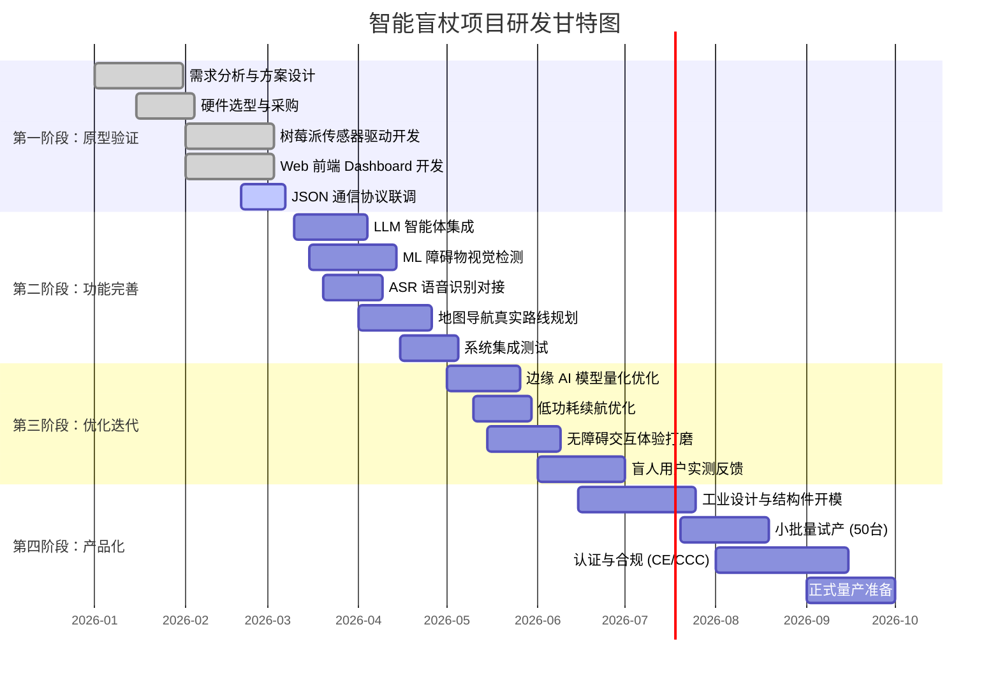

# 3.3 研发与生产计划

项目整体研发周期规划为 10 个月（2026 年 1 月 — 10 月），采用四阶段渐进式推进策略：先用最小原型验证端到端可行性，再逐步叠加 AI 能力、优化用户体验，最终完成工业化生产。每个阶段都设有明确的里程碑和 GO/NO-GO 决策点，确保资源不被浪费在不可行的方向上。

## 3.3.1 研发阶段规划

### 第一阶段：原型验证（2026.01 — 2026.03）

本阶段的核心目标是**证明技术方案可行**。硬件团队完成传感器选型和树莓派驱动开发，前端团队同步搭建 Web Dashboard，双方于阶段末通过 JSON 通信协议完成端到端联调。这一阶段不追求功能完整性，重点验证数据链路的可靠性和延迟指标。

| 任务 | 负责方向 | 交付物 | 验收标准 |
|------|----------|--------|----------|
| 需求分析与方案设计 | 产品 + 技术 | PRD 文档、技术方案书 | 评审通过 |
| 硬件选型与采购 | 硬件 | 树莓派 4B + 传感器套件 | 全部到货并通电验证 |
| 传感器驱动开发 | 嵌入式 | Python 采集脚本 | 5 路传感器数据正常读取 |
| Web 前端开发 | 前端 | React Dashboard 5 页面 | TypeScript 零错误，功能完整 |
| 通信协议联调 | 全栈 | 端到端数据流通 | JSON 上报延迟 <200ms |

### 第二阶段：功能完善（2026.03 — 2026.05）

在原型验证通过后，进入 AI 能力集成阶段。三条线并行推进：LLM 智能体集成（对话与播报）、ML 障碍物视觉检测（TFLite 模型训练与部署）、ASR 语音识别对接。地图导航同步接入真实的路线规划引擎。阶段末进行系统集成测试，确保各模块协同工作无阻塞缺陷。

| 任务 | 负责方向 | 交付物 | 验收标准 |
|------|----------|--------|----------|
| LLM 智能体集成 | AI + 前端 | Agent 服务 + 智能播报页面 | 多轮对话正常，响应 <3s |
| ML 障碍物检测 | AI | TFLite 模型 + 推理脚本 | 树莓派端 >5FPS，mAP >0.6 |
| ASR 语音识别 | AI | 语音识别模块 | 中文识别准确率 >85% |
| 路线规划对接 | 前端 + 后端 | OSRM 路线服务 | 规划耗时 <1s，路线可视化 |
| 系统集成测试 | 测试 | 测试报告 | 核心流程 0 阻塞缺陷 |

### 第三阶段：优化迭代（2026.05 — 2026.07）

本阶段从"能用"走向"好用"。AI 团队对模型进行 INT8 量化优化以适配树莓派算力；嵌入式团队实施动态功耗管理策略以延长续航；前端团队联合产品团队打磨无障碍交互细节。最关键的活动是引入真实视障用户参与测试——计划邀请不少于 10 名受试者进行为期 4 周的实地使用，收集反馈并快速迭代。

| 任务 | 负责方向 | 交付物 | 验收标准 |
|------|----------|--------|----------|
| 模型量化优化 | AI | INT8 量化模型 | 推理速度提升 2x，精度损失 <3% |
| 低功耗优化 | 嵌入式 | 功耗管理策略 | 连续使用续航 >8 小时 |
| 无障碍交互打磨 | 前端 + 产品 | 交互优化版本 | 盲人用户可独立完成核心操作 |
| 用户实测 | 产品 + 测试 | 用户反馈报告 | 完成 ≥10 名视障用户测试 |

### 第四阶段：产品化（2026.07 — 2026.10）

最终阶段将原型转化为可量产的消费级产品。工业设计团队完成人体工学外壳设计和模具开模，生产线小批量试产 50 台并评估良品率，同步启动 CE/CCC 等合规认证流程。此阶段完成后项目具备正式上市条件。

| 任务 | 负责方向 | 交付物 | 验收标准 |
|------|----------|--------|----------|
| 工业设计 | 工业设计 | 3D 模型 + 结构件模具 | 人体工学评审通过 |
| 小批量试产 | 生产 | 50 台样机 | 良品率 >95% |
| 认证合规 | 合规 | CE / CCC 证书 | 获得相关认证 |
| 量产准备 | 生产 + 供应链 | BOM + 产线工艺文件 | 供应链就绪 |

---

## 3.3.2 关键里程碑

项目设置 5 个关键里程碑作为阶段性验收节点。每个里程碑对应一次正式评审，根据交付物的完成情况做出 GO/NO-GO 决策，避免在技术方向不可行时继续投入资源。

| 里程碑 | 时间节点 | 关键交付 | 决策点 |
|--------|----------|----------|--------|
| M1 原型联调 | 2026-03 | 端到端数据流通 | 确认硬件方案可行性，GO/NO-GO |
| M2 AI 集成 | 2026-05 | 三大 AI 模块上线 | 评估 AI 效果，决定模型方向 |
| M3 用户测试 | 2026-07 | 用户反馈报告 | 根据反馈决定功能优先级调整 |
| M4 试产 | 2026-08 | 50 台样机 | 评估良品率，决定量产方案 |
| M5 发布 | 2026-10 | 认证 + 量产 | 定价与渠道策略确认 |

---

## 3.3.3 成本预算估算

成本控制是盲人辅助设备能否普及的关键因素。我们将成本分为两部分：一次性硬件 BOM 和持续性云服务运营费。硬件方面，原型阶段使用通用开发板和模块，单台 BOM 约 ¥590；量产阶段通过定制 PCB 和批量采购可进一步压缩至 ¥400 以内。运营方面，得益于 OpenStreetMap 免费瓦片和 DeepSeek 等高性价比模型，月度成本可控制在 ¥300 左右。

### 单台硬件 BOM 成本（原型阶段）

| 组件 | 型号/规格 | 单价 (¥) |
|------|-----------|----------|
| 主控板 | 树莓派 4B 4GB | 380 |
| 超声波传感器 | HC-SR04 × 2 | 12 |
| IMU 模块 | MPU6050 | 8 |
| GPS 模块 | NEO-6M | 25 |
| 摄像头 | USB 720P | 35 |
| 麦克风 | USB 全向麦 | 20 |
| 扬声器 | 3W 小喇叭 + 功放 | 15 |
| 锂电池 | 18650 × 2 (7800mAh) | 40 |
| 电源管理 | 充放电保护板 | 10 |
| 结构件 | 3D 打印外壳 (原型) | 30 |
| 线材/接插件 | 杜邦线、排针等 | 15 |
| **合计** | | **¥590** |

### 云服务与运营成本（月度）

| 项目 | 说明 | 月费 (¥) |
|------|------|----------|
| LLM API 调用 | GPT-4o-mini / DeepSeek，预估 1000 次/天 | 200 |
| 云服务器 | 2C4G 轻量服务器（中转/存储） | 60 |
| 地图 API | OSM 免费 / 高德备选 | 0 - 100 |
| 域名 + CDN | 前端静态资源托管 | 30 |
| **合计** | | **¥290 - 390** |

---

## 3.3.4 风险管理

任何硬件 + AI 项目都面临不确定性。我们识别了 6 项主要风险并制定了对应的缓解策略。其中影响最大的两项是"LLM API 不稳定"和"ML 模型精度不达标"——前者通过内置 Mock 规则引擎和多模型热切换实现双保险，后者通过"超声波为主、视觉为辅"的降级策略确保即使视觉模型效果不理想，基础安全功能依然可用。

| 风险项 | 概率 | 影响 | 应对策略 |
|--------|------|------|----------|
| LLM API 不稳定/停服 | 中高 | 高 | 内置 Mock 规则引擎兜底；支持多模型热切换 |
| 硬件供货延迟 | 中 | 中 | 提前备货核心器件；备选供应商清单 |
| ML 模型精度不达标 | 中 | 高 | 多数据集混合训练；超声波为主、视觉为辅的降级策略 |
| 用户接受度低 | 低 | 高 | 早期引入视障用户参与设计；快速迭代交互方案 |
| 认证周期超预期 | 中 | 中 | 提前启动认证流程；预留 1.5 倍时间缓冲 |
| 电池续航不足 | 中高 | 高 | 动态功耗策略；备选更大容量电池方案 |

---

> **小结：** 项目采用四阶段渐进式研发路径，从原型验证到产品化历时约 10 个月。通过 5 个关键里程碑把控进度，单台硬件 BOM 成本控制在 ¥590 以内，月度运营成本约 ¥300。同时建立 6 项风险应对策略，确保项目按计划推进。
